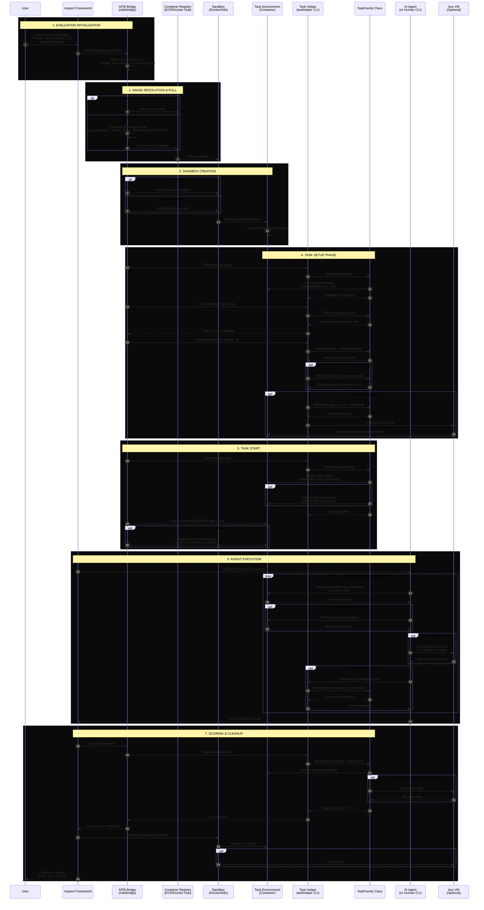

# METR Task Bridge (to inspect) Sequence Diagram (CLAUDE GENERATED)

```mermaid
sequenceDiagram
    autonumber
    
    participant User
    participant Inspect as Inspect Framework
    participant Bridge as MTB Bridge<br/>(mtb/bridge)
    participant Registry as Container Registry<br/>(ECR/Docker Hub)
    participant Sandbox as Sandbox<br/>(Docker/K8s)
    participant TaskEnv as Task Environment<br/>(Container)
    participant TaskHelper as Task Helper<br/>(taskhelper CLI)
    participant TaskFamily as TaskFamily Class
    participant Agent as AI Agent<br/>(or Human CLI)
    participant AuxVM as Aux VM<br/>(Optional)

    rect rgb(10, 10, 10)
        Note over User,Bridge: 1. EVALUATION INITIALIZATION
        User->>Inspect: inspect eval mtb/bridge<br/>-T image_tag=blackbox-1.0.2<br/>--sample-id apple
        Inspect->>Bridge: Load bridge task definition
        Bridge->>Bridge: Parse task parameters<br/>(image_tag, sample_id, sandbox type)
    end

    rect rgb(10, 10, 10)
        Note over Bridge,Registry: 2. IMAGE RESOLUTION & PULL
        alt Full image name provided
            Bridge->>Registry: Pull image directly
        else Tag only provided
            Bridge->>Bridge: Construct full image name<br/>using INSPECT_METR_TASK_BRIDGE_REPOSITORY
            Bridge->>Registry: Pull constructed image
        end
        Registry-->>Sandbox: Image available
    end

    rect rgb(10, 10, 10)
        Note over Bridge,TaskEnv: 3. SANDBOX CREATION
        alt sandbox=docker (default)
            Bridge->>Sandbox: Create Docker container
        else sandbox=k8s
            Bridge->>Sandbox: Create Kubernetes pod
        end
        Sandbox->>TaskEnv: Initialize task environment
        TaskEnv->>TaskEnv: Set up /home/agent directory
    end

    rect rgb(10, 10, 10)
        Note over TaskEnv,TaskFamily: 4. TASK SETUP PHASE
        Bridge->>TaskHelper: Call taskhelper install
        TaskHelper->>TaskFamily: TaskFamily.install()
        TaskFamily->>TaskEnv: Install dependencies<br/>(apt packages, pip, etc.)
        TaskFamily-->>TaskHelper: Installation complete
        
        Bridge->>TaskHelper: Call taskhelper get_tasks
        TaskHelper->>TaskFamily: TaskFamily.get_tasks()
        TaskFamily-->>TaskHelper: Return task definitions dict
        TaskHelper-->>Bridge: Task list with metadata
        
        Bridge->>TaskHelper: Get task details for sample_id
        TaskHelper->>TaskFamily: TaskFamily.get_instructions(task)
        TaskFamily-->>TaskHelper: Task instructions string
        
        opt Task has permissions requirements
            TaskHelper->>TaskFamily: TaskFamily.get_permissions(task)
            TaskFamily-->>TaskHelper: Permissions (full_internet, etc.)
        end
        
        opt Aux VM required
            TaskHelper->>TaskFamily: TaskFamily.get_aux_vm_spec(task)
            TaskFamily-->>TaskHelper: VM specification
            TaskHelper->>AuxVM: Create auxiliary VM
            AuxVM-->>TaskEnv: Network connection established
        end
    end

    rect rgb(10, 10, 10)
        Note over Bridge,TaskFamily: 5. TASK START
        Bridge->>TaskHelper: Call taskhelper start
        TaskHelper->>TaskFamily: TaskFamily.start(task)
        TaskFamily->>TaskEnv: Initialize task state<br/>(create files, start processes)
        opt Task has hidden root processes
            TaskFamily->>TaskEnv: Start localhost services<br/>(hidden from agent user)
        end
        TaskFamily-->>TaskHelper: Start complete
        
        Bridge->>TaskEnv: chown /home/agent files to agent user
        
        opt Network restrictions needed
            Bridge->>TaskEnv: Apply network sandboxing<br/>(if not full_internet permission)
        end
    end

    rect rgb(10, 10, 10)
        Note over Inspect,Agent: 6. AGENT EXECUTION
        Inspect->>Agent: Initialize with task instructions
        
        loop Agent attempts to solve task
            Agent->>TaskEnv: Execute bash/Python commands<br/>(as agent user)
            TaskEnv-->>Agent: Command output
            
            opt Task uses localhost services
                Agent->>TaskEnv: HTTP requests to localhost
                TaskEnv-->>Agent: Service responses
            end
            
            opt Task uses Aux VM
                Agent->>AuxVM: SSH/network access<br/>(if permitted by task)
                AuxVM-->>Agent: VM interaction results
            end
            
            opt Intermediate scoring
                Agent->>TaskHelper: Request intermediate score
                TaskHelper->>TaskFamily: TaskFamily.intermediate_score(task)
                TaskFamily-->>TaskHelper: Current score/status
                TaskHelper-->>Agent: Score feedback
            end
        end
        
        Agent->>Inspect: Submit solution string
    end

    rect rgb(10, 10, 10)
        Note over Inspect,TaskFamily: 7. SCORING & CLEANUP
        Inspect->>Bridge: Score submission
        Bridge->>TaskHelper: Call taskhelper score
        TaskHelper->>TaskFamily: TaskFamily.score(task, submission)
        TaskFamily->>TaskEnv: Inspect environment state
        opt Task uses Aux VM for scoring
            TaskFamily->>AuxVM: Check VM state
            AuxVM-->>TaskFamily: VM state data
        end
        TaskFamily-->>TaskHelper: Return score (0.0 - 1.0)
        TaskHelper-->>Bridge: Score result
        Bridge-->>Inspect: Final score + metadata
        
        Inspect->>Sandbox: Teardown task environment
        Sandbox->>TaskEnv: Destroy container
        opt Aux VM exists
            Sandbox->>AuxVM: Destroy VM
        end
        
        Inspect-->>User: Evaluation results<br/>(score, logs, metrics)
    end
```